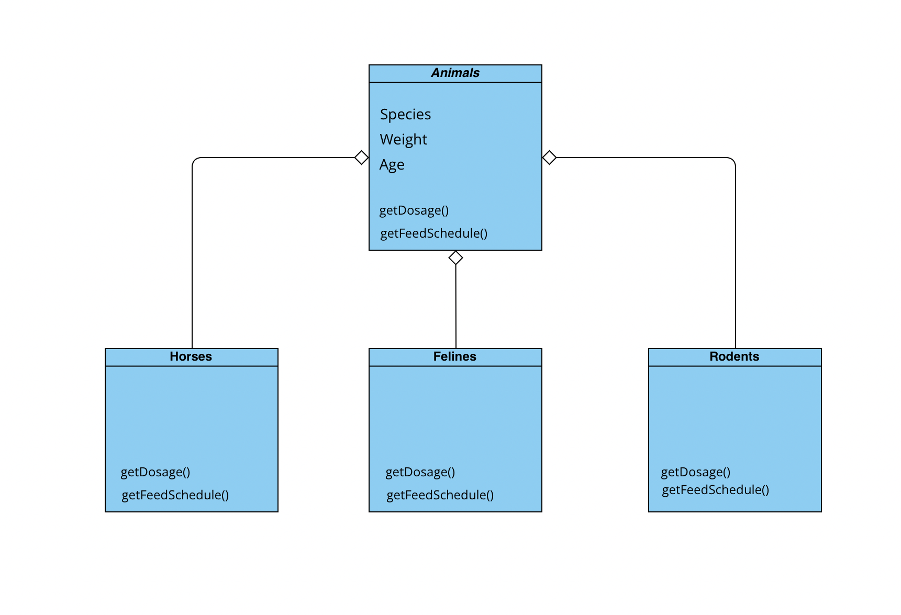

#### Zoo Management System

* Hayvanlar:
* Atlar (atlar, zebralar, eşekler vb.),
* Kedigiller (kaplanlar, aslanlar vb.),
* Kemirgenler (sıçanlar, kunduzlar vb.) gibi gruplardaki türlerle karakterize edilir.
* Hayvanlar hakkında depolanan bilgilerin çoğu tüm gruplamalar için aynıdır.
* tür adı, ağırlığı, yaşı vb.
* Sistem ayrıca her hayvan için belirli ilaçların dozajını alabilmeli => getDosage ()
* Sistem Yem verme zamanlarını hesaplayabilmelidir => getFeedSchedule ()

Sistemin bu işlevleri yerine getirme mantığı, her gruplama için farklı olacaktır. Örneğin, atlar için yem verme algoritması farklı olup, kaplanlar için farklı olacaktır.

Polimorfizm modelini kullanarak, yukarıda açıklanan durumu ele almak için bir sınıf diyagramı tasarlayın.

### Response

> Hayvanlar Abstract sınıftır-new'lenemez-ve Atlar, Kemirgenler, Kedigiller hayvanlardan değişken ve metotları kalıtım ile alır.

> Genel olarak tüm  class'larda değişkenler aynı olduğu için classlara ekstra değişken tanımlaması yapılmadı, kilo-yaş abstract sınıftan alınacak niteliklerdir.

>  Her türe özel ilaç dozları ve yem zamanlarının hesaplanması algoritmaları farklı olduğu için türler class'ında bu metotlar override edildi. Yani özetle: Kedigillerden türetilen Kedi class'ı Hayvanlar'ın niteliklerinden weight age gibi temel değişkenleri kalıtım yoluyla alırken abstracttan gelen getDosage() ve getFeedSchedule() metotlarını Kedigiller class ında override edilmiş şekilde alacaktır.